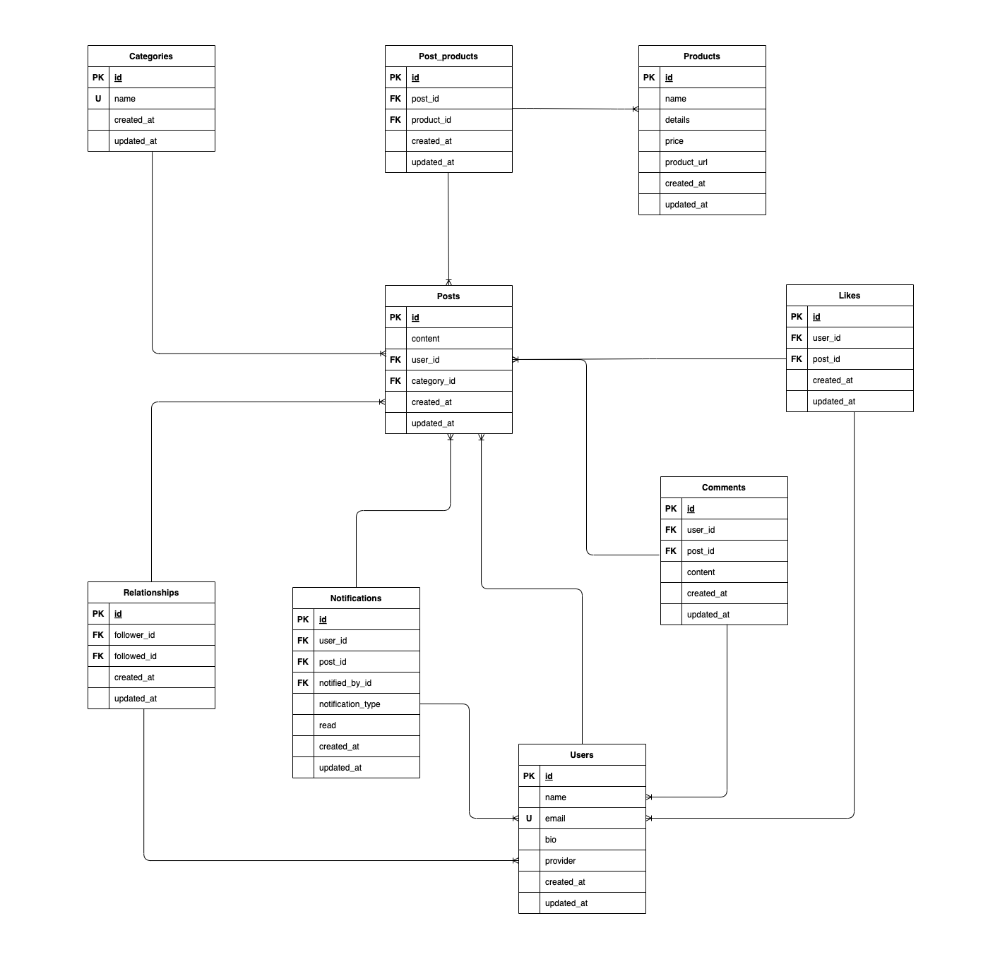

## サービス概要

新しい趣味を始めたいが必要なものがわからない方や、 他のユーザーとの交流を通じて趣味を深めたい方に最適なサービスです。

▼ サービス URL
 
https://hobbylink.vercel.app/

## サービスを作成したきっかけ

私は趣味で釣りをしており、これまで何度か友人や同僚から「釣りを始めたいけど何を買えばいいかわからない」と相談を受けてきました。
 
その際におすすめの商品や私が使っている商品をひとつひとつ紹介していましたがもっと手軽に共有できる方法があればいいなと感じていました。
 
そこで、釣りに限らず他の趣味でも手軽に情報を共有できるようになれば、同じような悩みを持っている方にも役立つと思い、このアプリの開発に挑戦しようと思いました。

## 使用技術

| カテゴリ               | 技術                                                                                                                                    |
| :--------------------- | :-------------------------------------------------------------------------------------------------------------------------------------- |
| フロントエンド         | TypeScript / React / Next.js / MUI                                                                                                      |
| バックエンド           | Ruby / Ruby on Rails                                                                                                                    |
| データベース           | PostgreSQL                                                                                                                              |
| 認証                   | NextAuth.js                                                                                                                             |
| 環境構築               | Docker / docker-compose                                                                                                                 |
| CI/CD                  | Github Actions                                                                                                                          |
| インフラ               | Vercel / Heroku / AWS S3                                                                                                                |
| API                    | Rakuten Web Service                                                                                                                     |
| その他(フロントエンド) | Prettier / ESLint / zod /react-hook-form / swr / axios / framer-motion / react-share / camelcase-keys / i / react-intersection-observer |
| その他(バックエンド)   | ActiveStorage / rack-cors / rubocop / pg / puma /aws-sdk-s3 / kaminari / jwt / active_model_serializers                                 |

## 実装機能

|                                            ログイン                                             |                                    ホーム画面                                    |                              検索画面                               |
| :---------------------------------------------------------------------------------------------: | :------------------------------------------------------------------------------: | :-----------------------------------------------------------------: |
|                              |             |  |
| ログインボタンを押すと、ログインモーダルが 表示され、Google アカウントでログインができます。 | 新着投稿、おすすめ投稿 が閲覧でき、各投稿のいいね、コメント数を確認できます。 |       カテゴリーやキーワード検索ができ、投稿が閲覧できます。        |

 

|                              投稿画面                               |                                                              商品検索画面                                                              |                              お知らせ画面                               |
| :-----------------------------------------------------------------: | :------------------------------------------------------------------------------------------------------------------------------------: | :---------------------------------------------------------------------: |
|  |                                                                 |  |
| 自分の趣味で使っている商品、おすすめアイテムを自由に投稿できます。  | 投稿画面の商品追加ボタンをクリックし、 商品検索画面にて、自分が使用している商品やおすすめアイテムを検索し、投稿に追加できます。 |     自分の投稿に対するいいねやコメント、フォローの確認ができます。      |

 

|                                            マイページ                                            |                              投稿詳細画面                               |                              商品詳細画面                               |
| :----------------------------------------------------------------------------------------------: | :---------------------------------------------------------------------: | :---------------------------------------------------------------------: |
|                             |  |  |
| プロフィールやフォロー中、フォロワー、自分が投稿した内容、いいねした投稿を確認できます。 |              投稿の内容やおすすめ商品を 確認できます。               | 商品に関する詳細や、 実際に使用されている投稿を 確認ができます。  |

 

|                                  いいね                                  |                                          コメント                                          |                                  投稿シェア                                   |
| :----------------------------------------------------------------------: | :----------------------------------------------------------------------------------------: | :---------------------------------------------------------------------------: |
|       |                         |          |
| いいねボタンをクリックすることで、各投稿にいいねすることが できます。 | コメントボタンをクリックし、 コメント一覧ページでコメントの投稿、編集、削除ができます。 | 各SNSボタンをクリックすることで、投稿を簡単にシェア することができます。 |

## ER 図

## インフラ図

## 画面遷移図

[Figma](https://www.figma.com/design/24rgRaUhoinbc4mCYvAr6P/%E7%94%BB%E9%9D%A2%E9%81%B7%E7%A7%BB%E5%9B%B3?node-id=0-1&m=dev&t=iBEKxCRAfLZeEr1S-1)
